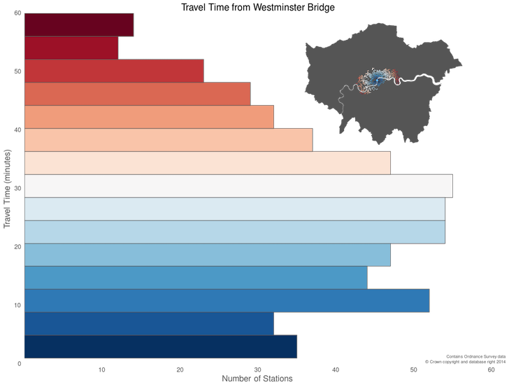
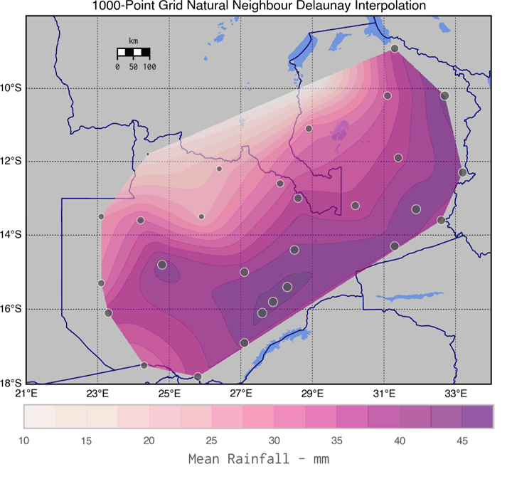
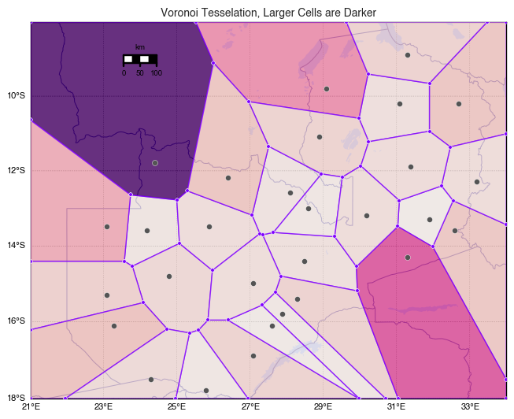
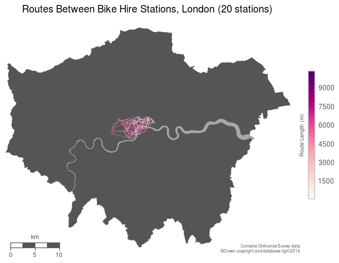
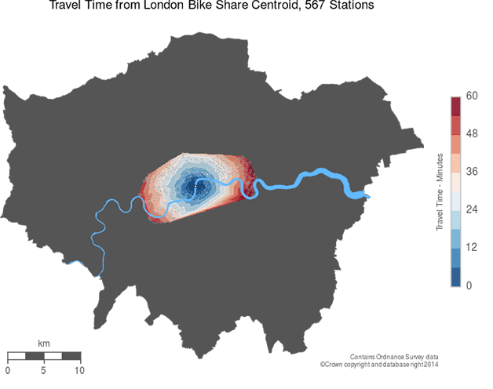
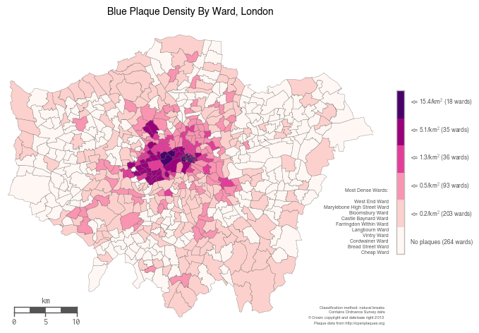
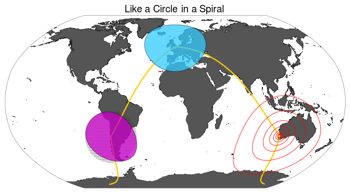

# geoPy

## Geocomputation, Cartography, and Spatial Analysis Techniques Using Python

It is a repository of varied geo / spatial research methods using Python libraries, chiefly Numpy, Pandas, Shapely, Fiona, Descartes, Matplotlib, and Matplotlib-Basemap.

[Airbnb](https://github.com/slowy07/geoPy/blob/main/airbnb.ipynb): mapping Airbnb rental data in London

[GWR](https://github.com/slowy07/geoPy/blob/main/geographically_weighted_regression.ipynb): An introduction to Geographically Weighted Regression using PySAL, using a worked example.

[Convert](convert.ipynb): demonstrates point, choropleth, and hexbin mapping techniques using pandas and Matplotlib Basemap  

[Convert_Folium](convert_folium.ipynb): demonstrates the use of the [Folium](https://github.com/wrobstory/folium) library for creating web-based maps from Python data (pandas) using [Leaflet](http://leafletjs.com) to generate a choropleth mapping

Router Comparison](https://github.com/urschrei/router_comparison): analyses route characteristics of journeys from the London Cycle Hire network centroid to 554 stations, calculated using [OSRM](https://mapzen.com/blog/osrm-sunset), Mapzen's new [Valhalla](https://mapzen.com/projects/valhalla/) router, and the [Google Maps Directions API](https://developers.google.com/maps/documentation/directions/intro). There's also some outlier identification using RANSAC, and hopefully useful wrappers for route retrieval in `helpers.py`.

[Contour](contour.ipynb): It shows the interpolation into a standard grid of irregularly distributed point data (mean rainfall), the measurement of a contour plot and its imposition on a basemap (see graph below). Delaunay Natural Neighbour ('matplotlib.griddata') and refinement of a coarse Delaunay mesh using 'matplotlib.UniformTriRefiner' that uses recursive subdivision and cubic interpolation are then contrasted with two methods for measuring continuous surfaces. High-res pictures are available in the folder [data](data) :umbrella::umbrella::umbrella:  
Finally, the map is partitioned into *clipped* Voronoi cells based on the sensor locations, and some plotting methods (more flexible than `scipy.spatial.voronoi2d`) are shown.

[Bikepath](bikepath.ipynb): takes a subset of London bicycle hire stations, creates a DataFrame of all possible origin and destination pairs, and then uses MapZen's wonderful [open Valhalla endpoint](https://mapzen.com/projects/valhalla) to get valid bicycle routes between them. These routes are then plotted (it's just the first 400 – there are over 490k origin / destination pairs in total) on a map.

[Plaques_Geopandas](plaques_geopandas.ipynb): demonstrates [Geopandas](http://geopandas.org) and its spatial join functionality, used to create a choropleth.

### Installation and usage

Note that for most users, the Enthought [Canopy](https://www.enthought.com/products/canopy/)
The easiest way to get the needed libraries is definitely the Python distribution (You'll have to install Folium and GeoPandas separately, they're not included). However, if you know what you are doing, you would still need separate compilers to load the libraries manually using 'requirements.txt'
(GCC, Fortran), and libraries (GDAL, GEOS). The use of a [virtualenv](http://virtualenv.readthedocs.org/en/latest/) is advised.  
The Rust libraries (though not their Python counterparts) require a Rust installation. For most platforms (OS X, Windows, *nix), using [rustup.rs](https://rustup.rs) is the easiest way to install and update a Rust installation.

## Libraries
[Circles](circles.ipynb)  
Demonstrates drawing circles with correct distortion characteristics on a map (the dot-shaded circle is erroneously non-distorted). The helper library used to plot the circles is available [here](https://github.com/urschrei/Circles).

[Lonlat-BNG](https://github.com/urschrei/lonlat_bng/blob/master/rust_BNG.ipynb)  
A demonstration of writing a [Rust](http://www.rust-lang.org) library, and linking it to Python using FFI, in order to carry out fast Longitude and Latitude to British National Grid transformations, using multithreading. I've blogged about the process [here](http://sensitivecities.com/rust-python-ffi-bng-EN.html). The Python library is available [here](https://github.com/urschrei/convertbng).

[Pypolyline](https://github.com/urschrei/pypolyline)  
A Python library for encoding and decoding Google encoded polylines, using a Rust binary and FFI.

[RDP](https://github.com/urschrei/rdp)  
A Rust implementation of the Ramer–Douglas–Peucker line simplification algorithm. Includes an FFI wrapper.

[Polylabel-rs](https://github.com/urschrei/polylabel-rs)  
A Rust implementation of the Mapbox Polylabel algorithm, which determines optimum label placement on a polygon by calculating its pole of inaccessibility. The library has an FFI wrapper, and a sample Python script which demonstrates its use (I know Shapely also includes the algorithm, but it's a pure-Python implementation, and this one is…somewhat faster)

## license & copyright
[**MIT LICENSE**](https://github.com/slowy07/geoPy/blob/main/LICENSE)\
[**copyright**](https://github.com/urschrei/Geopython)
